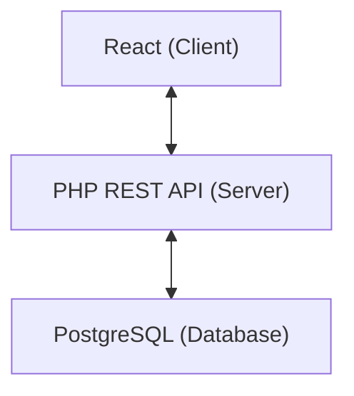

## App flow




## Docker

### Create a .env file following the .env.example file

### Dev Environment

- Run ```docker compose -f docker-compose.dev.yml up -d```
- Run ```php -S localhost:8000``` from server/
- Run ```npm start``` from client/

### Production Environment
- Run ```docker compose up --build```